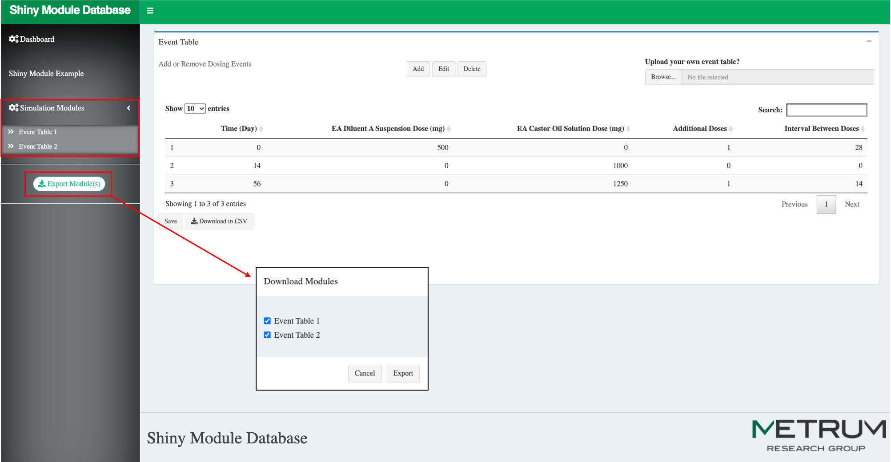

<!-- README.md is generated from README.Rmd. Please edit that file -->

The purpose of this app is to function as a database for shiny modules
for internal use at Metrum.

The goal is to approximate the functionality of [this
example](https://storybook.js.org/), whereby you can view, test, and
live-modify the code of each module to get a feel for its flexibility.
Developers can help populate the list of available modules, as well as
download the isolated files for use in future apps.

We often rewrite similar UIs for different applications. By capturing
modules used in previous apps we can save time in future projects where
similar modules are warranted.

